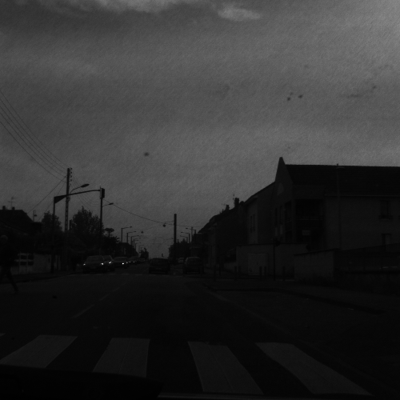
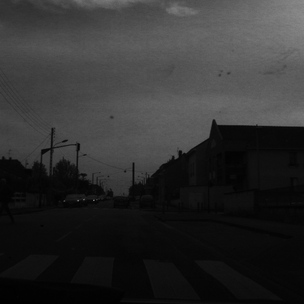
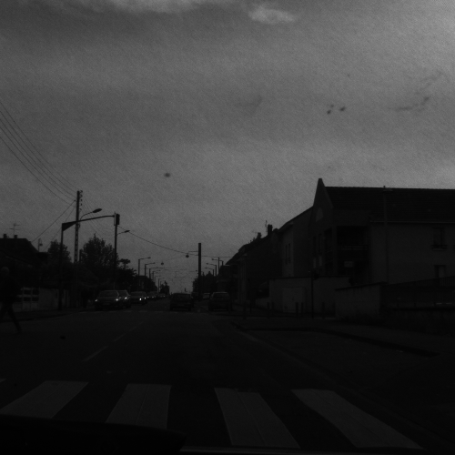
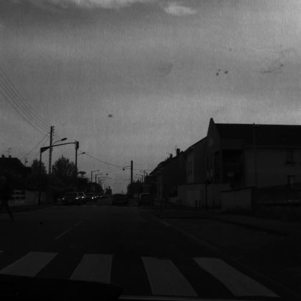
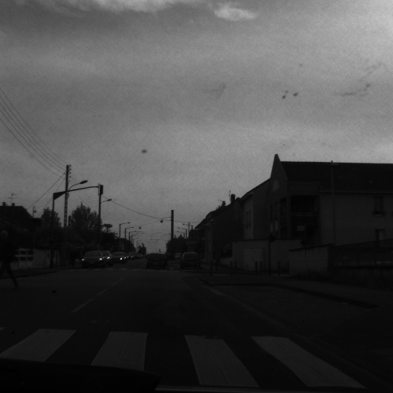
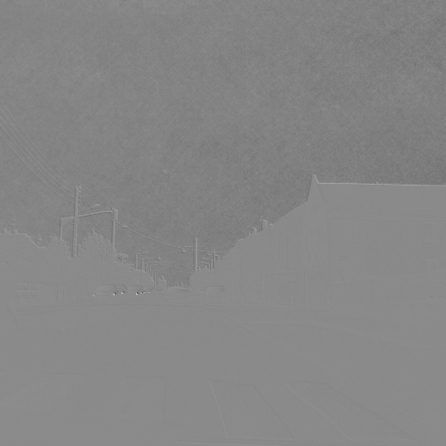
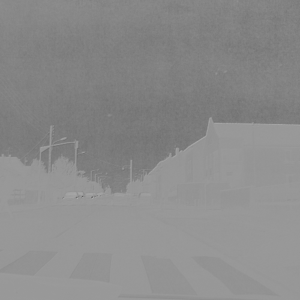
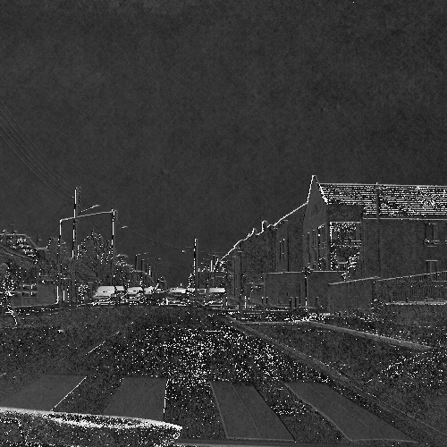
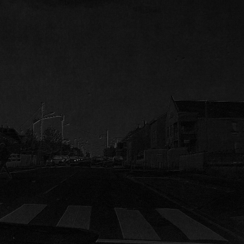

# Tools to process images

This project will group all the tools I use to make image processing. I work with polarimetric imaging for my PhD which need to be processed in a specific way to get all the parameters.

## Polarimetric images 

Polarimetric images can be obtained thanks to a property of lightwaves than can oscillate with more than one orientation. They can provide more information regarding objects on a scene that can be characterized by their reflection which provides physical properties of the objects. The polarimetric camera I'm using for my PhD is a PolarCam ([4D Technology](https://www.4dtechnology.com/products/imaging-polarimeters/)). It provides an image divided into superpixels, each one containing the four intensities corresponding to the four angles of rotation of the polarizer (0, 45, 90 and 135 degrees).

Here's an example of the four intensities of a scene:

I0

I45

I90

I135

From those four intensities, we can compute the Stokes parameters and then the Angle and Degree of Polarization. There are three Stokes parameters (S0, S1 and S2) describing the total intensity for the first one and roughly the amount of linearly polarized light for the two others.

Here are the Stokes parameters of the scene:

S0

S1

S2

Here are the Angle and Degree of polarization of the scene:

AOP

DOP

## Prerequisites

All the programs work with Python 3.6. The libraries needed to run the programs are:
* numpy
* matplotlib
* opencv

## Authors

* **Rachel Blin** - [Website](http://pagesperso.litislab.fr/rblin/)
